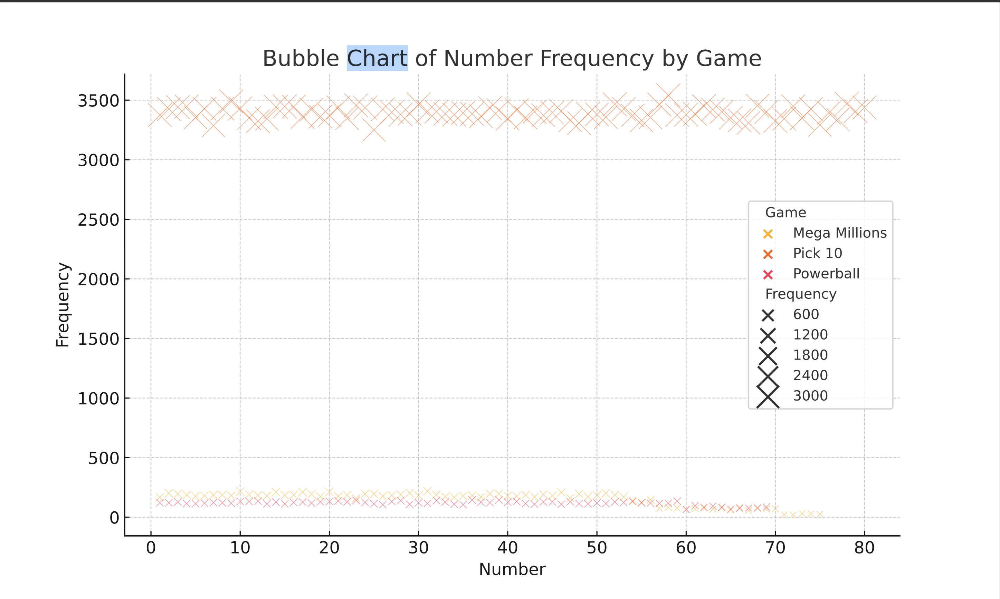
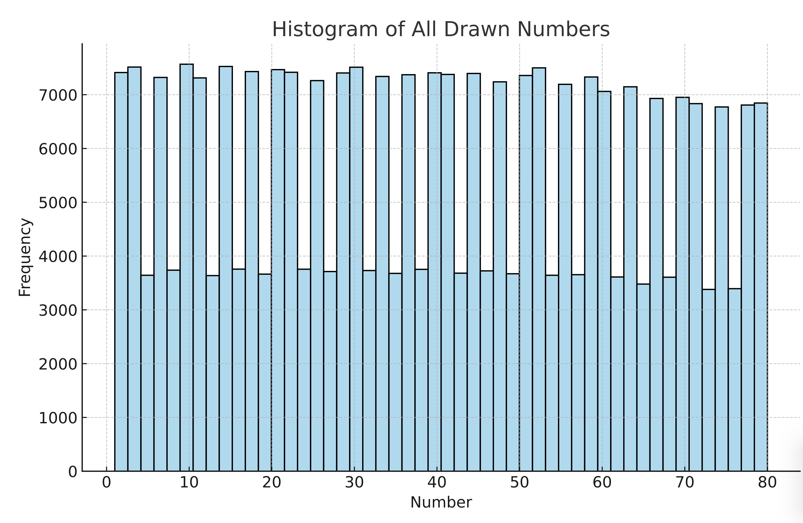
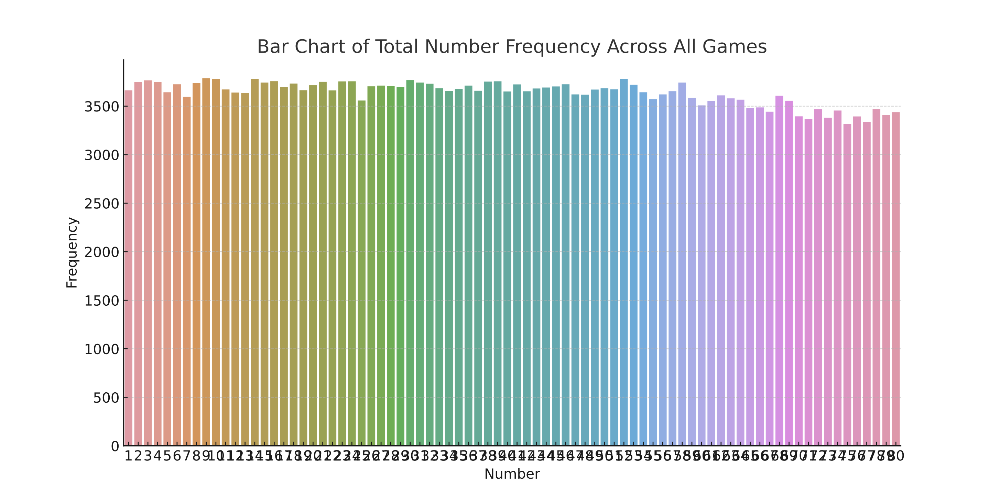

# Lottery Analytics: Multi-Game Lottery Number Analysis



## Project Overview

Lottery Analytics is a data analytics project that explores historical lottery drawing data from three major lottery games:

- Powerball
- Mega Millions
- Pick 10

The project combines datasets from all three games into a unified analytical framework to identify trends, number frequencies, distributions, and historical drawing patterns.

The goal of this project is to demonstrate data cleaning, transformation, exploratory data analysis (EDA), statistical visualization, and analytical storytelling using Python.

---

## Business Problem

Lottery organizations generate massive amounts of drawing data over time. While lottery outcomes are random, analyzing historical data provides valuable insight into:

- Number frequency distributions
- Drawing trends over time
- Cross-game comparisons
- Data visualization techniques
- Large-scale data processing workflows

This project demonstrates how data analytics can be applied to historical lottery datasets using industry-standard Python tools.

---

## Objectives

- Clean and standardize multiple lottery datasets
- Merge Powerball, Mega Millions, and Pick 10 data
- Transform datasets into long-format analytical structures
- Perform exploratory data analysis (EDA)
- Visualize number distributions and drawing behavior
- Generate professional reporting outputs

---

## Technologies Used

- Python
- Pandas
- NumPy
- Matplotlib
- Seaborn
- Jupyter Notebook

---

## Dataset

The analysis includes historical drawing data from:

### Powerball
Lottery numbers drawn over multiple years.

### Mega Millions
Historical drawing results and number combinations.

### Pick 10
Historical Pick 10 drawing data.

The datasets were cleaned and transformed into a combined analytical dataset for visualization and reporting.

---

## Project Workflow

### 1. Data Collection

Multiple lottery datasets were imported into Python using Pandas.

### 2. Data Cleaning

- Removed invalid records
- Standardized date formats
- Converted lottery numbers into numerical format
- Prepared datasets for analysis

### 3. Data Transformation

Each dataset was converted into a long-format structure.

Columns included:

- Draw Date
- Game
- Position
- Number

This allowed all games to be analyzed together.

### 4. Exploratory Data Analysis

The project examined:

- Frequency distributions
- Number occurrence rates
- Cross-game comparisons
- Historical drawing patterns

### 5. Visualization

Several visualizations were generated to support findings.

---

## Visualizations

### Number Distribution



Analyzes how frequently each number appears across all games.

---

### Number Frequency Analysis



Displays total occurrence counts for each number.

---

### Draw Trends Over Time


Shows historical lottery number distributions across drawing dates.

---

### Multi-Game Comparison


Compares number frequency distributions between Powerball, Mega Millions, and Pick 10.

---

## Key Findings

- Lottery numbers exhibit relatively uniform distributions.
- No single number consistently dominates across all games.
- Number frequencies remain relatively stable over time.
- Historical data demonstrates expected characteristics of random number generation.
- Visualization techniques provide an effective method for analyzing large-scale lottery datasets.

---

## Project Structure

```text
LotteryAnalytics/
│
├── data/
│   ├── powerball_cleaned.csv
│   ├── megamillions_cleaned.csv
│   └── pick10_cleaned.csv
│
├── notebook/
│   └── Lottery Ticket Buyers.ipynb
│
├── visuals/
│   ├── LotteryAnalyticsAI.png
│   ├── LotteryNumberDistribution.png
│   ├── LotteryDrawsOverTime.png
│   └── LotteryNumberFrequency.png
│
├── README.md
└── requirements.txt
```

---

## Future Enhancements

- Predictive modeling experiments
- Time-series analysis
- Monte Carlo simulations
- Statistical significance testing
- Interactive dashboards using Streamlit
- Power BI integration

---

## Author

### Darious Brown

GitHub:
https://github.com/Dare215

LinkedIn:
https://www.linkedin.com/in/dariousbrown

Portfolio:
https://dare215.github.io/DariousBrown-Portfolio/

Email:
dariousbrown3@icloud.com

---

## License

This project is intended for educational, research, and portfolio purposes.
